 

Probability Part A
==================

Event T = person is truthful clicker

Event A = answered yes in survey

Goal: find the proportion of truthfull clickers who answered yes

*P*(*A*)=*P*(*A*|*T*)\**P*(*T*)+*P*(*A*|*T*′) \* *P*(*T*′)

0.65 = *P*(*A*|*T*)\*(0.7)+(0.5)\*(0.3)

*P*(*A*|*T*)=0.7143

**71.43% of truthfull clickers answered yes to the survey.**

 

Probability Part B
==================

Event A = person actually has the disease

Event T = person tests positive for the disease

  *First find *P*(*T*) using Law of Total Probability *

*P*(*T*)=*P*(*T*|*A*)\**P*(*A*)+*P*(*T*|*A*′) \* *P*(*A*′)

*P*(*T*)=(0.993)\*(0.000025)+(0.0001)\*(0.999975)

*P*(*T*)=0.0001248225

  *Now find *P*(*A*|*T*) using Bayes Theorem*

$P(A|T) = \\frac{P(A)\*P(T|A)}{P(T)}$

$P(A|T) = \\frac{(0.993)\*(0.000025)}{0.0001248225}$

*P*(*A*|*T*)=0.19888

**After a positive test result, there is still only a 20% chance a
person has the disease. Implementing this testing universally will lead
to a lot of false positives. These people will need to be retested
(possibly multiple times) to confirm the disease, or go through
different tests that are more conclusive.**

 

Exploratory Analysis: Green Buildings
=====================================

In my opinion, this analysis is critically shortsighted. The on-staff
stats guru blindly compares green buildings to non-green buildings,
considering no other factors that might affect rent.. He effectively
attributes 100% of the $2.60 average increase in rent to whether or not
a building being green.

Upon further investigation, I believe that this decision requires more
analysis. It is difficult to recommend that the building be built green
or not based on the limited information available.

My initial analysis included a multiple linear regression to assess the
relative importance of all predictor variables. The output is as shown
below:

It appears that whether or not a building is green is insignificant when
determining the rent. The P-value is 0.327867, suggesting that green
rating is not significant holding all other factors constant. Important
features include cluster, leasing rate, age, class a, and others.

I further investigated the predictor variables for a potential
confounding effect. (For example, can we attribute an increase in rent
to the fact that a building is green or to that fact that it is new,
condiering that most green buildings are new? It is difficult to isolate
the effect of a green building.)

Starting with the age of a building, we can see that in the entire
dataset, the average age of a building is roughly 46 years old, and the
average age of green buildings is roughly 23 years old.

If we compare the mean rent of all(green or not) "old" buildings (over
23 years) and new buildings (under 23 years) we can see that the stats
guru's assertion of a ~$2 increase in rent per square foot remains true.
We therefore cannot know if the $2 increase is due to the fact that a
building is new or green, as these factors are systematically
correlated.

    ## Mean rent for buildings < 23 years:  30.6139

    ## Mean rent for buildings > 23 years:  28.41857

    ## Premium per sq. ft.:  2.195333

This means that we can't necessarily differentiate the effect of green
buildings and the effect of new buildings. The stats guru concluded that
green buildings see a premium of $2.6 by being a green building, but you
essentially get this premium just by being a new building.

Note: I chose 'new' buildings to be those under 23 years, which is the
average age of green buildings. I split the data here so that the effect
of green buildings on rent(if any), would be the same on either side of
the age split.

The second variable I investigated for a confounding affect was class A.
Class A buildings are typically the most desired as they are the highest
quality. You can see a similar confounding affect.

Roughly 80% of green buildings are of the type class A, whereas only 40%
of the overall population are class A buildings. This means that again,
we cannot assume that an increase in rent is directly caused by a
building being green instead of a building being of class A. In fact, we
can ssume that being green does not affect the rent nearly as much as
other factors (if at all) based on the output of the initial regression
analysis coefficients. (Recall that green\_rating had a Pvalue of
0.327867)

    ## Mean Class A rent:  32.31842

    ## Mean Not-Class A rent:  28.41857

    ## Premium per sq. ft.:  3.899848

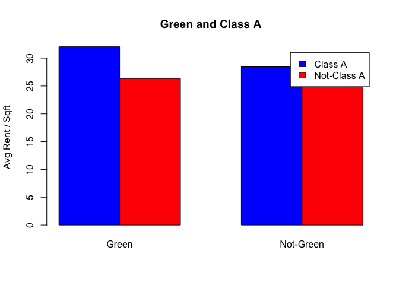

The graph above confirms our assertion that an increase in rent cannot
solely be attributed to a building being green, but rather contains
other factors. Having a green certification alone does not increase the
expected rent of a building. Instead, one that is green and class A
receives a premium, while all others are at relatively the same level.
Our recommendation is to first consider other factors such as age, class
a, amenities, cluster, etc. and then determine if tenants in these
specific building types are willing to pay a premium for a green
building, and if so, how much of a premium.

Bootstrapping
=============

    ## [1] "SPY" "TLT" "LQD" "EEM" "VNQ"

<table class="table table-striped table-hover" style="margin-left: auto; margin-right: auto;">
<thead>
<tr>
<th style="text-align:left;">
</th>
<th style="text-align:right;">
SPY
</th>
<th style="text-align:right;">
TLT
</th>
<th style="text-align:right;">
LQD
</th>
<th style="text-align:right;">
EEM
</th>
<th style="text-align:right;">
VNQ
</th>
</tr>
</thead>
<tbody>
<tr>
<td style="text-align:left;">
Average Annual Return
</td>
<td style="text-align:right;">
10.65048
</td>
<td style="text-align:right;">
7.138739
</td>
<td style="text-align:right;">
5.321800
</td>
<td style="text-align:right;">
27.92763
</td>
<td style="text-align:right;">
10.88338
</td>
</tr>
<tr>
<td style="text-align:left;">
Annualized Standard Deviation
</td>
<td style="text-align:right;">
19.71232
</td>
<td style="text-align:right;">
14.502576
</td>
<td style="text-align:right;">
8.264503
</td>
<td style="text-align:right;">
63.72211
</td>
<td style="text-align:right;">
33.50292
</td>
</tr>
</tbody>
</table>
The above table shows the annualized returns and standard deviation in
returns of our five assets. Using these metrics as proxies for return
and risk, respectively, we can their general characteristics. SPY
commonly represents "the market" by indexing the US's 500 largest
stocks. Over the last eight and a half years it has returned 10% on
average, but had a standard deviation of almost 20% due to sharp rises
an falls. TLT and LQD are fixed income securities that offer lower
returns, but much more consistent returns. Between them, the corporate
bonds (LQD) show lower risk and returns, likely because the security is
diversified across companies while TLT is 100% tied to the US
government. In contrast, EEM represents emerging market stocks which
have high potential gains, but also extremely high volatility. Lastly
the real estate ETF (VNQ) returned roughly the same on average as the
S&P, but with significantly higher volatility. This does not seem to
follow the notion of higher risk is rewarded with higher returns.

The charts below show the simulated ending value of portolios made up of
differing combinations of these five assets, starting with equal weights
on each. The safer portolio is designed with the goal of reducing
variance in returns and value at risk. It is invested 40% in TLT, 40% in
LQD, 20% in SPY, and excludes the assets with the highest variance in
returns. The aggressive portfolio attempts to meet the goal of
increasing expected returns by investing 40% in SPY, 50% in EEM, 10% in
VNQ, and excluding the fixed income securities.

Equally Weighted Portfolio
--------------------------

 

Safe Portfolio
--------------

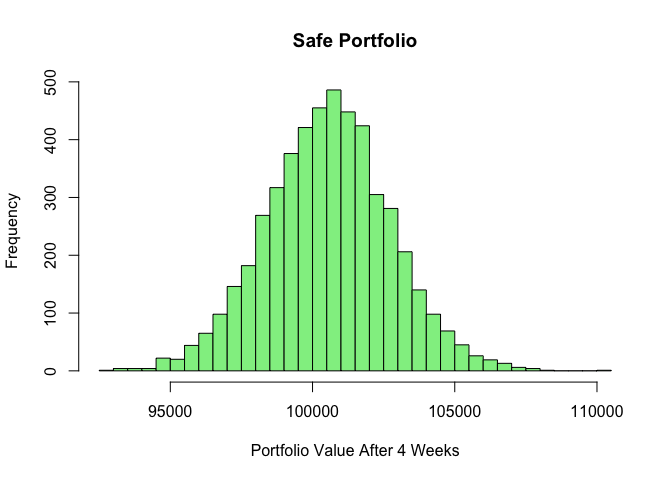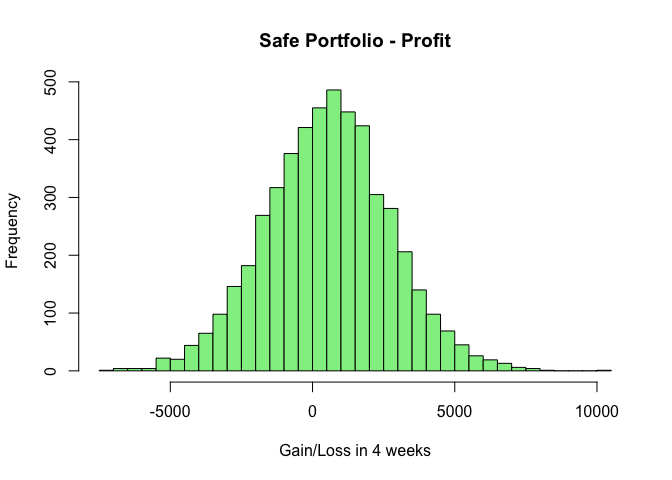

 

Aggressive Portfolio
--------------------

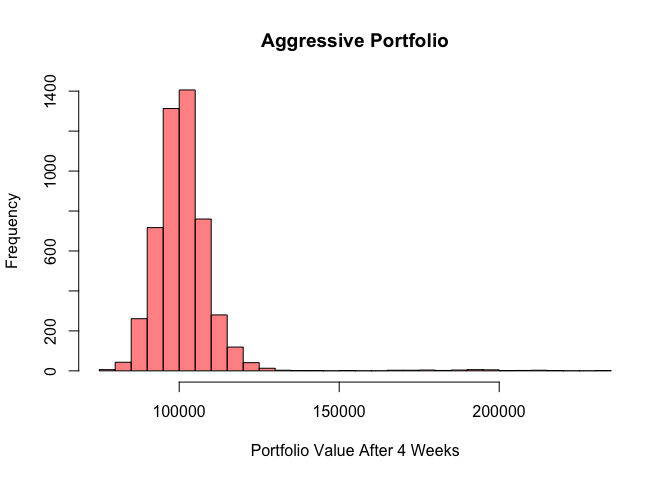

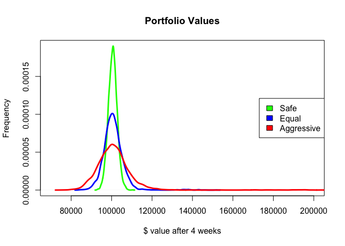
<table class="table table-striped table-hover" style="margin-left: auto; margin-right: auto;">
<thead>
<tr>
<th style="text-align:left;">
</th>
<th style="text-align:right;">
Equal Weights
</th>
<th style="text-align:right;">
Safe
</th>
<th style="text-align:right;">
Aggressive
</th>
</tr>
</thead>
<tbody>
<tr>
<td style="text-align:left;">
Value in 4 Weeks
</td>
<td style="text-align:right;">
100798.982
</td>
<td style="text-align:right;">
100548.090
</td>
<td style="text-align:right;">
101352.4
</td>
</tr>
<tr>
<td style="text-align:left;">
5% Value at Risk
</td>
<td style="text-align:right;">
-6173.608
</td>
<td style="text-align:right;">
-3083.255
</td>
<td style="text-align:right;">
-10796.3
</td>
</tr>
</tbody>
</table>
Analysis
--------

The table above shows the simulated expected return and 5% Value at Risk
for the three portfolios. Value at Risk (VaR) represents the dollar
value loss associated with the worst 5% possible outcomes. As expected,
the safer distribution of assets primarily into fixed income securities
reduced the VaR of the portfolio by nearly 50% compared to the equally
weighted portfolio. However, the expected profit was also reduce by
almost 50%. In contrast, the aggressive portfolio that excluded fixed
income securities nearly doubled the VaR and simulated profit. The
density plot above even shows the possibility for the agrressive
portfolio to double in value over just the four-week timespan.

As an investor, your choice should be made depending on your risk
tolerance and time horizon. A longer time frame can make use of the
aggressive portfolio to achieve heigher expected returns and weather out
the large variations. A shorter time frame can utilize the safer
portfolio to secure a low VaR while receiving some gains.

 

Market Segmentation
===================

### Find K

The above graph shows the result of running a Kmeans model on the entire
scaled dataset and calculating the CH Index value for each value of k
(number of clusters). We chose a k = 6 from the plot where the points
formed a small elbow, and then ran the KMeans cluster analysis. After
running the cluster analysis, we plotted pairwise plots of the top five
variables (sorted by importance to cluster) in each cluster
(representing our six market segments), which gave the following graphs
and interpretations per group.

 

### Cluster 1 - The Noise/Bots

*11.27% of followers*

This cluster is composed mainly of those tags Twitter tries to weed out,
including spam, random chatter, and inappropriate adult content. It can
be mostly randomly generated by bots, so it's very irrelevant for
Nutrient H2O's marketing team to focus on these characteristics.

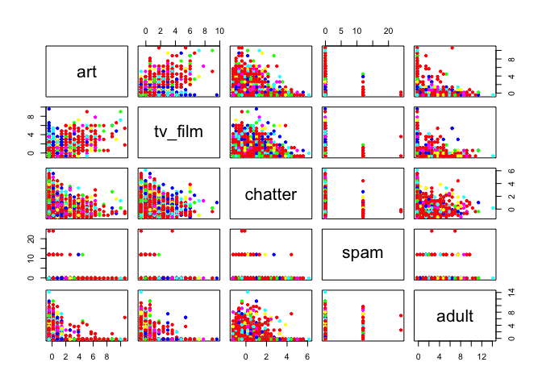

### Cluster 2 - The Instagram Influencer

*5.44% of followers*

Those in this segment are most likely social-media savvy and are on top
of trends relating to music, photo sharing, beauty, fashion, and
cooking. They share a lot of photos relating to their lifestyle and
these categories suggest that the content they share could be curated
according to these categories. Nutrient H2O can appeal to this segment
by sharing/retweeting photos and possibly relate their products to
current trends relating to fashion, beauty, cooking, etc.

### Cluster 3 - The Young Professional

*7.28% of followers*

This cluster was identified by valuing subjects such as automotives,
computers, travel, the news, and politics very highly. A young
professional would travel a lot for work, be highly technology savvy,
and very engaged in news and politics. They love sports cars, and they
hate Trump. We'd suggest for Nutrient H2O to focus on appealing to their
politically active tendencies and being up-to-date on news.

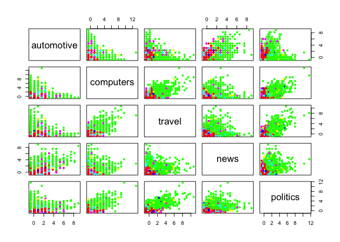

### Cluster 4 - The Whole Foodies

*8.65% of followers*

This cluster of healthy eating fans are really into bettering their
lifestyles in various ways. They're the kind of people that meal prep
using kale, spend time outdoors doing goat yoga, and indulge in
SoulCycle at least once a week. Most likely, they own a metal straw
\#savetheturtles. Nutrient H2O can appeal to this segment by
highlighting the health benefits in their products and supporting
eco-friendly, sustainable practices.

### Cluster 5 - The College Student

*9.96% of followers*

Your average college student is highly engaged in the bubble of their
school activities and social life. Often, they escape from the pressure
of deadlines by immersing themselves into activities like Netflix,
gaming online, and ultimate frisbee or flag football. Nutrient H2O can
win this segment over with NFL-themed deals, or by appealing to school
pride.

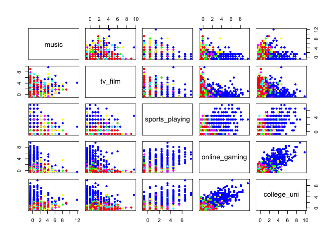

### Cluster 6 - The Soccer Moms

*57.66% of followers*

This cluster represents the the typical soccer mom, tweeting about
things relating to school, food, sports, parenting, and religion.
They're probably the super involved parents, volunteering at their kids'
schools, signing their kids up for various sports and afterschool
activities, and goes to church every Sunday. They're not regular moms,
they're "cool moms."

Nutrient H2O can capture this segment by relating their marketing and
advertising to subjects like school, sports, or anything relating to
their kids. This is the largest segment by far and holds a lot of
spending power, so Nutrient H2O should definitely focus significant
energy and marketing dollars on this group. It may not be the most
obvious target segment, but their interests overlap with those that are
health-conscious or sports fans, indicating a large untapped potential.

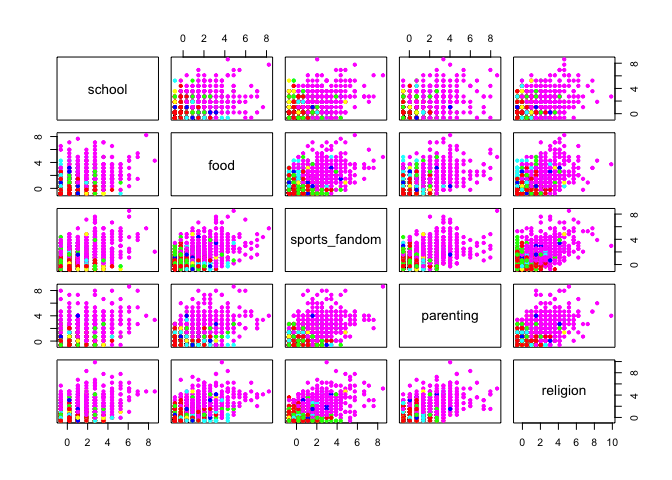

### PCA

We also tried PCA as another way to break down the list of users into
market segments. We used 15 principle components in order to account for
73% of the variance while not overfitting and maintaining as simple of a
model as possible.?

    ## Importance of first k=15 (out of 36) components:
    ##                           PC1     PC2     PC3     PC4     PC5     PC6
    ## Standard deviation     2.1186 1.69824 1.59388 1.53457 1.48027 1.36885
    ## Proportion of Variance 0.1247 0.08011 0.07057 0.06541 0.06087 0.05205
    ## Cumulative Proportion  0.1247 0.20479 0.27536 0.34077 0.40164 0.45369
    ##                            PC7     PC8     PC9    PC10    PC11    PC12
    ## Standard deviation     1.28577 1.19277 1.15127 1.06930 1.00566 0.96785
    ## Proportion of Variance 0.04592 0.03952 0.03682 0.03176 0.02809 0.02602
    ## Cumulative Proportion  0.49961 0.53913 0.57595 0.60771 0.63580 0.66182
    ##                           PC13    PC14    PC15
    ## Standard deviation     0.96131 0.94405 0.93297
    ## Proportion of Variance 0.02567 0.02476 0.02418
    ## Cumulative Proportion  0.68749 0.71225 0.73643

We next plotted all data points against the first 2 principle
components.

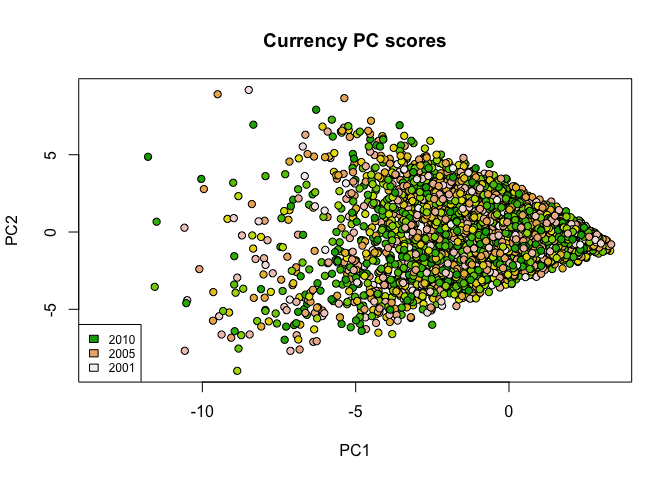

Unfortunately, there is not much of a takeaway from this graph, so the
team moved on to try to understand how the clusters relate to the
original variables.

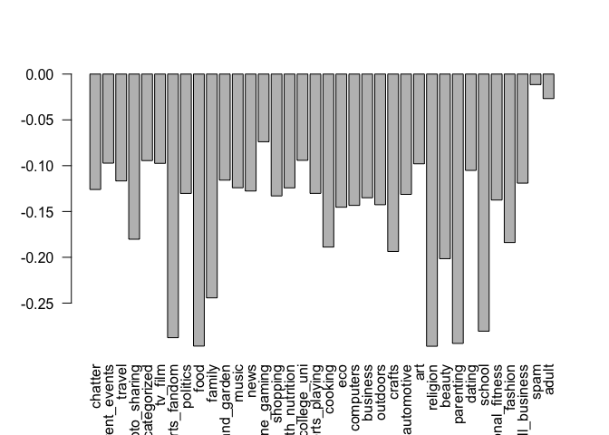

In this plot, the top 5 most significant variables are religion,
parenting, school, food, and sports\_fandom, which remains consistent
with our 'Family People' cluster from the kmeans algorithm.

For the sake of space, we decided only to include this one plot, but the
next few principle components remained consistent with our clusters from
the kmeans algorithm. As you begin to use other principle components you
start to see other smaller clusters form, which could be an interesting
way to find more niche market segments. For example, principle component
10's tweets seem to encompass things like home and garden, school, and
dating, which leads me to believe that it is a group of high-school aged
students living at home.

    barplot(pc1$rotation[,10], las=2)

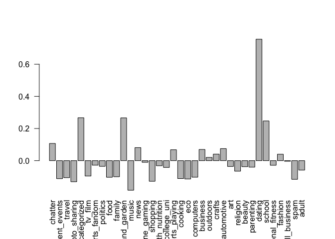
